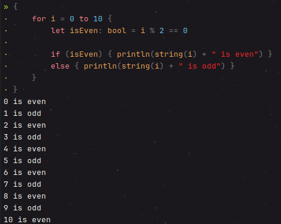

# Rhino

My first attempt at building a compiler. With the help
of [Immo Landwerth's tutorial series](https://www.youtube.com/playlist?list=PLRAdsfhKI4OWNOSfS7EUu5GRAVmze1t2y) on
building a compiler

## Table of Contents
- [Features](#run-locally)
  - [Operators](#operators)
  - [Assignments](#assignments)
  - [Expressions](#expressions)
  - [Functions](#functions)
  - [Scopes](#scopes)
  - [Conditions](#conditions)
  - [Loops](#loops)
  - [Built-in Functions](#built-in-functions)
  - [Type Conversion](#type-conversion)
  - [Primitive Types](#primitive-types)
  - [Meta Commands](#meta-commands)
- [Examples](#examples)
- [Misc](#misc)
- [Run Locally](#run-locally)
- [Running Tests](#running-tests)

## Features

### Operators

- `+` Addition
- `-` Subtraction
- `*` Multiplication
- `/` Division
- `(` and `)` Parentheses
- `&&` Logical AND
- `||` Logical OR
- `!` Logical NOT
- `&` Bitwise AND
- `|` Bitwise OR
- `^` Bitwise XOR
- `~` Bitwise NOT
- `<<` Bitwise Left Shift
- `>>` Bitwise Right Shift
- `==` Equality
- `!=` Inequality
- `<` Less than
- `<=` Less than or equal to
- `>` Greater than
- `>=` Greater than or equal to
- `=` Assignment
- `%` Modulus

### Assignments

- `var <identifier>(: <optional type>) = <value>` creates a mutable variable
- `let <identifier>(: <optional type>) = <value>` crates an immutable variable

### Expressions

- `(1 + 2) * 3`

### Functions

- `function <identifier>(<parameter 1>: <type>, ... <parameterN>: type) { ... }`

### Scopes

- `{ ... }`

### Conditions

- `if <condition> { ... } (optional) else { ... }`

### Loops

- `for <identifier> = <lowerBound> to <upperBound>`
- `while <condition>`

### Built-in functions

- `print(<expression>)` prints the expression to the console
- `println(<expression>)` prints the expression to the console in a new line
- `input()` reads a line from the console
- `random(<min>: int, <max>: int)` generates a random number
- `cos(<value>: double)` get the cosinus for the given value
- `sin(<value>: double)` get the sinus for the given value
- `acos(<value>: double)` get the arc cosinus for the given value
- `floor(<value>: double)` get the floor pf the given value

### Type conversion

- `string(<expression>)` converts the expression to a string
- `int(<expression>)` converts the expression to an integer
- `bool(<expression>)` converts the expression to a boolean
- `float(<expression>)` converts the expression to a float
- `double(<expression>)` converts the expression to a float

### Primitive types

- String
  `var myString = "myString"`
- Bool
  `var myBool = true`
- Int
  `var myInt = 1`
- Float
  `var myFloat = 0.2f`
- Double
  `var myDouble = 0.2`

### Meta commands:

- `#showTree` Shows parse tree
- `#showProgram` Shows bound tree
- `#cls` Clears the console
- `#reset` Resets the current compilation

## Examples:



## Misc:

### Control Flow Graph

The following code


Generates the following diagram


## Run Locally

- Install .NET >= 8.0
- Clone the project

```bash
  git clone git@github.com:Lxdovic/rhino.git
```

- Go to the project directory

```bash
  cd rhino
```
- Run the project

```bash
  dotnet run --project ./rc/rc.csproj
```

## Running Tests

To run tests, use the following commands

```bash
  cd rhino/
  dotnet test
```
